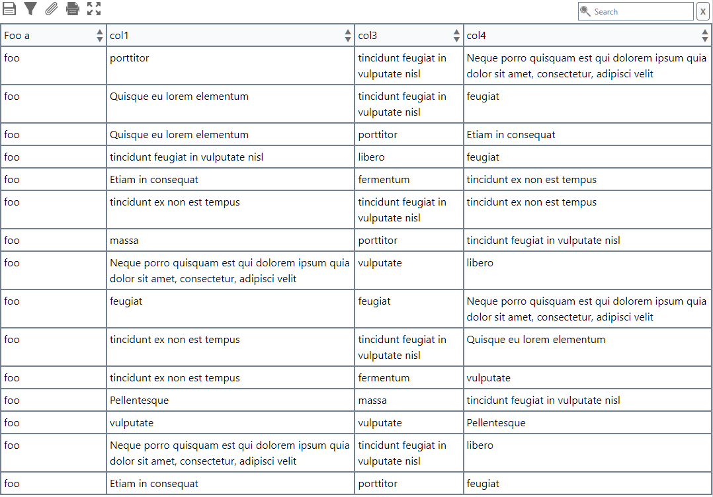

# Data-Table
A class to build responsive tables that are populated with json data




## Features
- Search
- Sort
- Handle values with function passed in such as adding a button
- Handles bothe keyed and unkeyed data sets
- Exports as JSON, CSV, TSV
- Copy table to clipboard
- Full Screen / Projection of the Table
- Print just the data

## Update CSS
npx tailwindcss -i ./src/input.css -o ./dist/clsDataTable.css --watch **/

### Usage
```
<div class="cntr"></div>

<script>
let dt = new clsDataTable(
    {
        container: document.querySelector('.cntr'),
        altRowColor: true,
        sort: true,
        freezeHeader: false,
        includeFooter: false,
        // rowHeight: '10rem',
        // rowHeightMin: '10rem',
        // rowHeightMax: '10rem',
        // colWidth: '10rem',
        // colWidthMin: '10rem',
        // colWidthMax: '10rem',
        // refreshFunction: () => {}, //There is a default to revert to original json data
        keyMap: {
            0: {
                title: 'Foo a',
                width: '10rem',
                minwidth: '10rem',
                maxwidth: '10rem',
                render: (data) =>
                {
                    return 'foo';
                },
                hidden: false
            },
            'b': {
                title: 'Foo b',
                render: (data) =>
                {
                    data = data.substring(0, 3);
                    return data;
                },
                hidden: false
            },
            2: {
                hidden: true
            },
            'col3': {
                hidden: false
            }
        }
    });
</script>
```

### Set JSON Data
```
//Function to generate random JSON Data
// numCols
// numRows
// dType (data type): bare, keyed
// rType (return type): string, json
// GenerateJsonData(numCols, numRows, dType, rType);
let jsonData = GenerateJsonData(5, 15, 'bare', 'json');

dt.setJsonData(jsonData);
```
```
dt.setJsonData('[[{"a":"Pellentesque"},{"b":"porttitor"},{"c":"libero"},{"d":"fermentum"},{"e":"tincidunt ex non est tempus"}],[{"a":"massa"},{"b":"libero"},{"c":"tincidunt feugiat in vulputate nisl"},{"d":"Pellentesque"},{"e":"libero"}],[{"a":"tincidunt ex non est tempus"},{"b":"tincidunt ex non est tempus"},{"c":"Pellentesque"},{"d":"fermentum"},{"e":"tincidunt feugiat in vulputate nisl"}],[{"a":"Pellentesque"},{"b":"Pellentesque"},{"c":"porttitor"},{"d":"Neque porro quisquam est qui dolorem ipsum quia dolor sit amet, consectetur, adipisci velit"},{"e":"Pellentesque"}],[{"a":"porttitor"},{"b":"fermentum"},{"c":"porttitor"},{"d":"Pellentesque"},{"e":"Pellentesque"}],[{"a":"porttitor"},{"b":"libero"},{"c":"porttitor"},{"d":"tincidunt ex non est tempus"},{"e":"fermentum"}],[{"a":"libero"},{"b":"vulputate"},{"c":"feugiat"},{"d":"Etiam in consequat"},{"e":"feugiat"}],[{"a":"tincidunt feugiat in vulputate nisl"},{"b":"Quisque eu lorem elementum"},{"c":"Quisque eu lorem elementum"},{"d":"Neque porro quisquam est qui dolorem ipsum quia dolor sit amet, consectetur, adipisci velit"},{"e":"feugiat"}],[{"a":"tincidunt feugiat in vulputate nisl"},{"b":"Neque porro quisquam est qui dolorem ipsum quia dolor sit amet, consectetur, adipisci velit"},{"c":"libero"},{"d":"vulputate"},{"e":"Quisque eu lorem elementum"}],[{"a":"Neque porro quisquam est qui dolorem ipsum quia dolor sit amet, consectetur, adipisci velit"},{"b":"tincidunt feugiat in vulputate nisl"},{"c":"massa"},{"d":"Quisque eu lorem elementum"},{"e":"Etiam in consequat"}]]');
```

or

```
dt.setJsonData('[["feugiat","libero","vulputate","libero","libero"],["vulputate","Pellentesque","Quisque eu lorem elementum","fermentum","Neque porro quisquam est qui dolorem ipsum quia dolor sit amet, consectetur, adipisci velit"],["porttitor","Etiam in consequat","tincidunt ex non est tempus","vulputate","fermentum"],["porttitor","feugiat","Pellentesque","Quisque eu lorem elementum","libero"],["tincidunt ex non est tempus","porttitor","tincidunt feugiat in vulputate nisl","libero","Pellentesque"],["vulputate","vulputate","tincidunt feugiat in vulputate nisl","Quisque eu lorem elementum","Pellentesque"],["porttitor","tincidunt ex non est tempus","Quisque eu lorem elementum","tincidunt ex non est tempus","vulputate"],["feugiat","feugiat","tincidunt feugiat in vulputate nisl","Etiam in consequat","vulputate"],["Pellentesque","feugiat","Pellentesque","Neque porro quisquam est qui dolorem ipsum quia dolor sit amet, consectetur, adipisci velit","porttitor"],["Etiam in consequat","libero","libero","massa","tincidunt ex non est tempus"]]');
```
